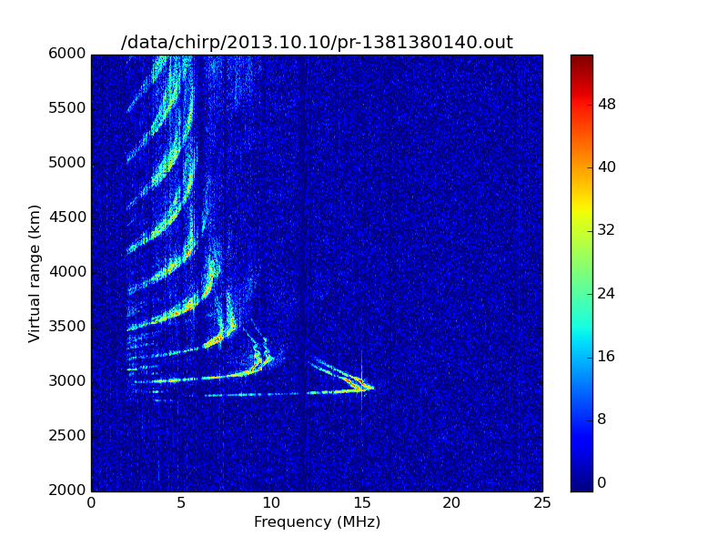
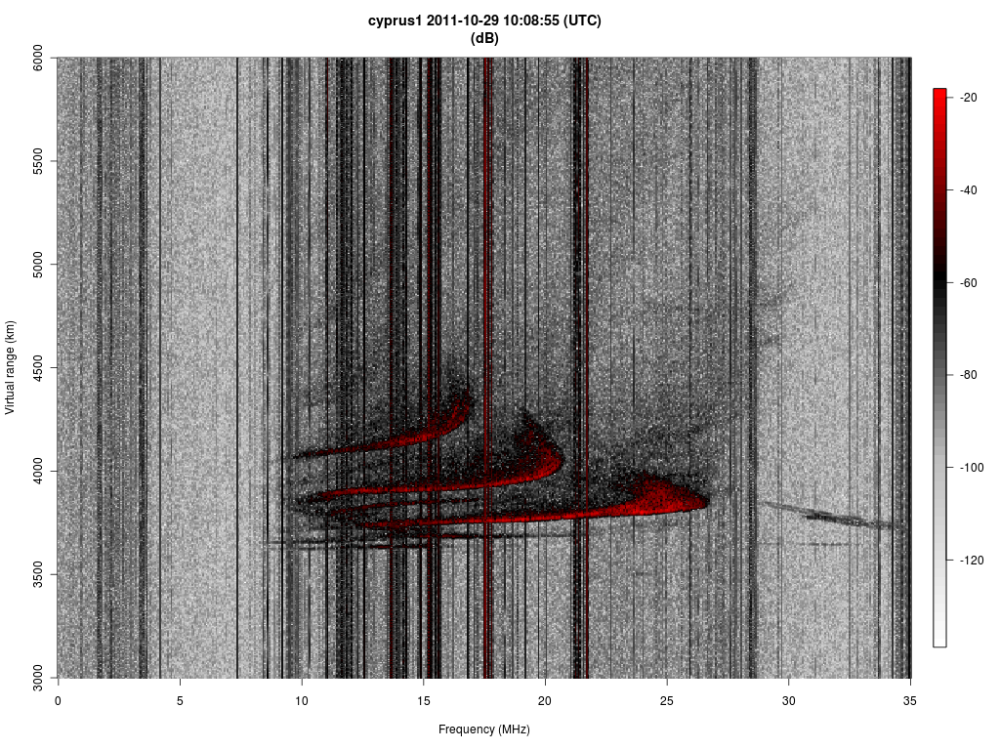
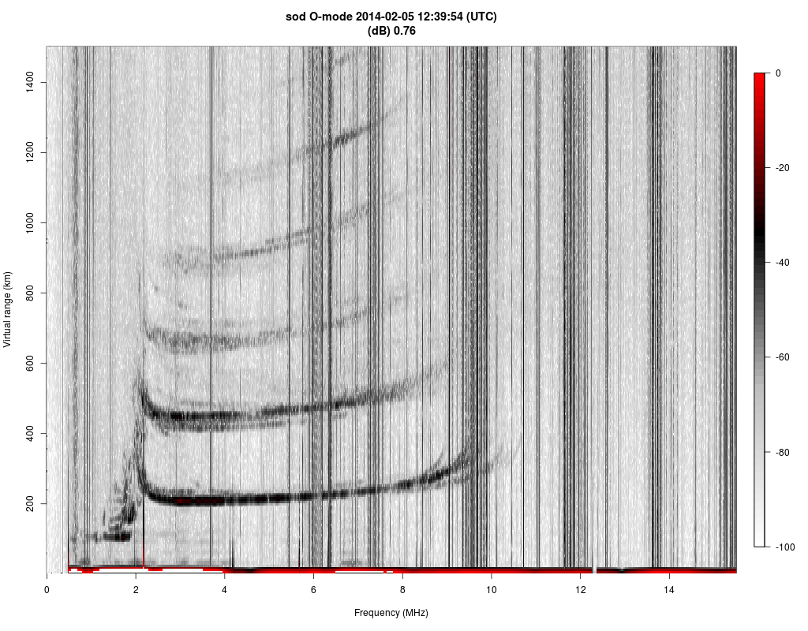
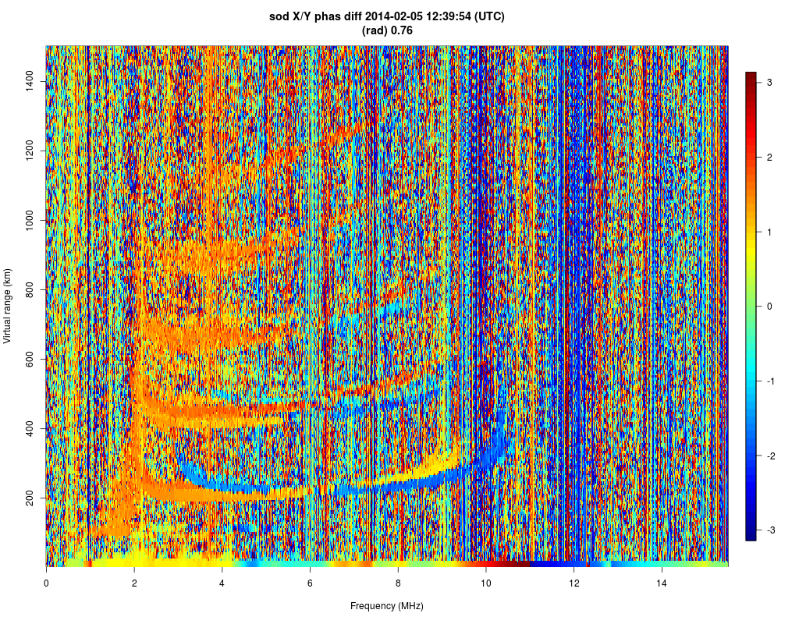
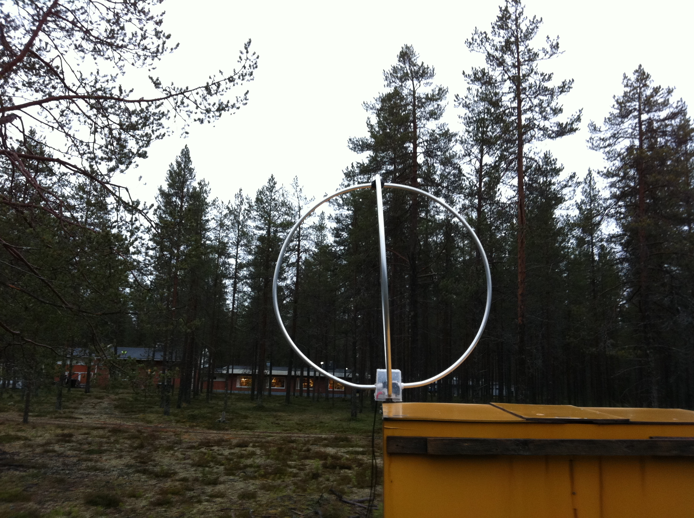

# GNU Chirpsounder

This is the new home for GNU Chirp Sounder. I no longer have access to the account for the old web site, so I am migrating things here. This will make it easier for me to keep the software up to date.

## Hardware 

The software relies on Ettus Research USRP N2x0 hardware and a GPSDO, which can provide a 1 PPS and 10 MHz reference signal. In addition to this, you will need a wide band HF antenna. This antenna should be in a location that is as radio quite as possible, with good filtering of common mode interference. I recommend placing the antenna at least 100 meters from power lines and any electronic equipment. 

## Software dependencies

The code depends on gnuradio and the uhd driver. I've recently used the software with Gnuradio 3.7.11 and Ubuntu 18.04. I also use at least: Numpy, FFTw, Scipy, and Matplotlib.

## Examples

### The Puerto Rico ROTHR transmitter recorded in Boston, MA

### The Cyprus 100 kHz/s sounder measured in Sodankylä

### Vertical O-mode sounding of the Sodankylä Chirp sounder

Two linear polarizations are combined to form an O-mode ionogram.

### Dual polarization measurement of the Sodankylâ Chirp ionosonde

The phase difference indicates O and X-mode traces of the ionogram.

### Animation example

Click the video below to see an example of a recording of the Cheasapeake Bay and Puerto Rico over-the-horizon radar soundings recorded in Boston, MA. 

## Hardware example

## Future plans

I am planning to migrate the code away from gnuradio, so that it only relies on the UHD driver. This change will be done in such a way that also other software defined radio hardware could also more easily be supported. 
